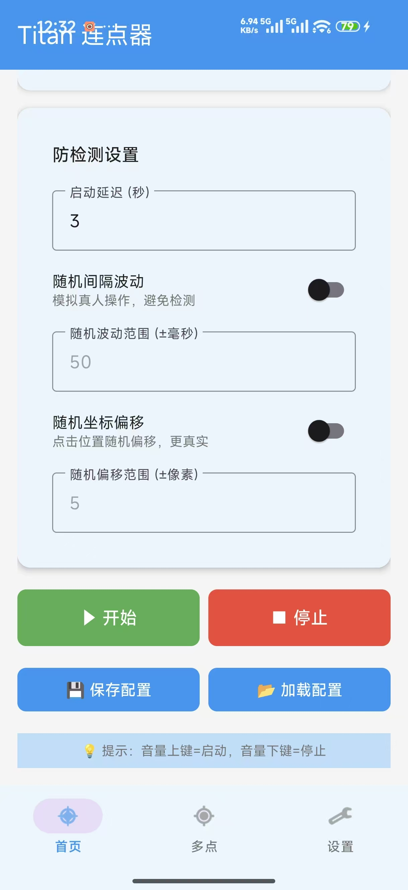
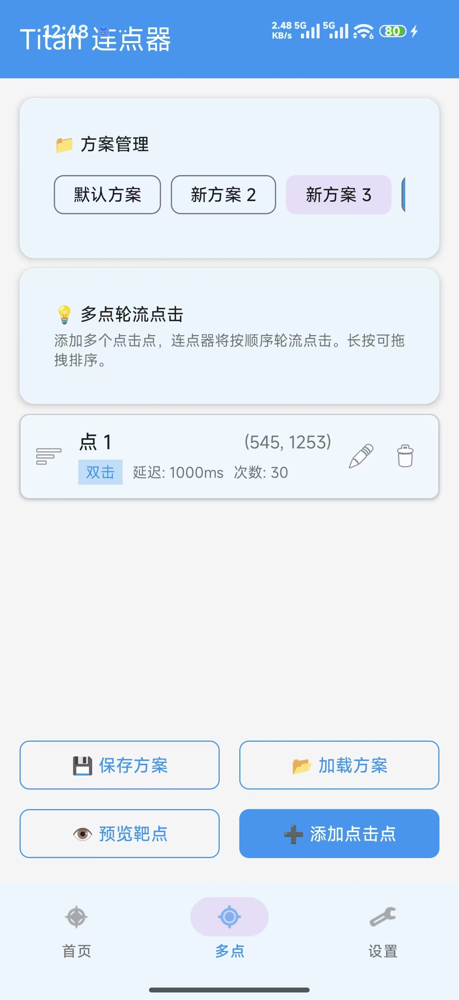
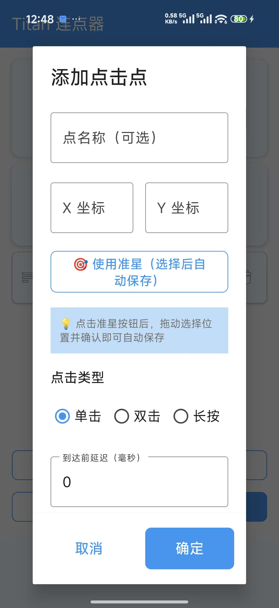
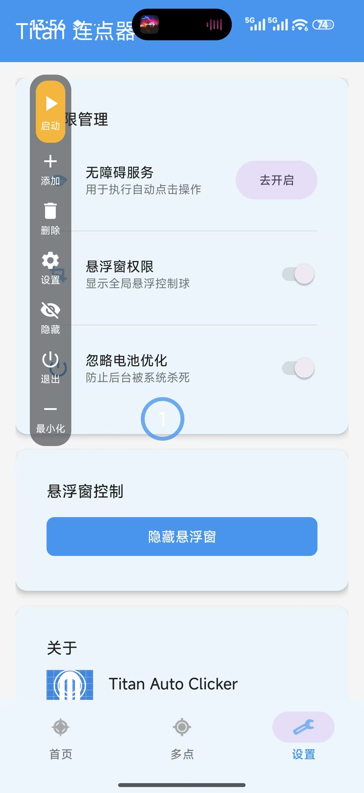
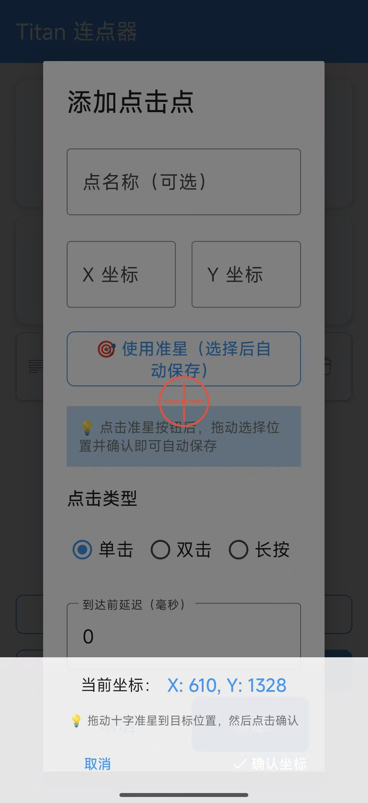
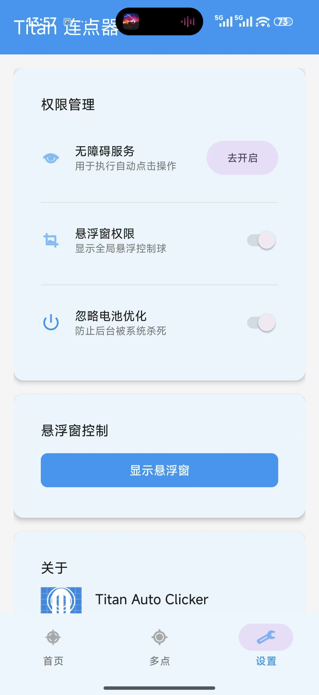

# Titan 连点器 - 官方发行版

**🎯 专业的 Android 自动点击工具**

**[📥 立即下载](https://github.com/cy15205969311/Titan-Auto-Clicker-Releases/releases/latest) | [📖 使用文档](#-使用指南) | [💻 源代码](https://github.com/cy15205969311/Titan-Auto-Clicker) | [🐛 问题反馈](https://github.com/cy15205969311/Titan-Auto-Clicker/issues)**

---

## 📥 下载安装

### 最新版本

**[📦 下载 Titan 连点器 v1.0](https://github.com/cy15205969311/Titan-Auto-Clicker-Releases/releases/download/v1.0/Titan-AutoClicker-v1.0.apk)**

*APK大小: 2.4MB | 最低系统: Android 7.0+ | 发布日期: 2026-02-10*

### 安装步骤

1. **下载APK文件**
   - 点击上方下载按钮
   - 或访问 [Releases 页面](https://github.com/cy15205969311/Titan-Auto-Clicker-Releases/releases)

2. **允许安装未知来源**
   - 设置 → 安全 → 允许安装未知来源应用
   - 或在安装时点击"允许"

3. **安装应用**
   - 打开下载的APK文件
   - 点击"安装"
   - 等待安装完成

4. **授予权限**
   - 打开应用
   - 授予无障碍服务权限
   - 授予悬浮窗权限（可选）

---

## 📱 应用截图

<table>
  <tr>
    <td></td>
    <td></td>
    <td></td>
  </tr>
  <tr>
    <td align="center">首页 - 防检测设置</td>
    <td align="center">多点管理</td>
    <td align="center">添加点击点</td>
  </tr>
</table>

<table>
  <tr>
    <td></td>
    <td></td>
    <td></td>
  </tr>
  <tr>
    <td align="center">悬浮窗控制</td>
    <td align="center">准星选点</td>
    <td align="center">设置页面</td>
  </tr>
</table>

---

## ✨ 核心功能

### 🎯 多点位管理系统
- ✅ 支持无限个点击点
- ✅ 每个点位独立设置坐标、延迟、点击次数
- ✅ 支持单击、双击、长按、滑动四种操作类型
- ✅ 可视化列表管理，一目了然

### 📋 智能方案系统
- ✅ 创建多个点击方案，快速切换
- ✅ 方案独立保存，互不干扰
- ✅ 一键启动/停止，操作便捷
- ✅ 方案数据本地保存，永不丢失

### 🎨 悬浮窗控制
- ✅ 紧凑型悬浮窗设计，不遮挡屏幕
- ✅ 支持拖动定位，随心所欲
- ✅ 一键添加/删除点位
- ✅ 实时显示运行状态
- ✅ 可最小化为小圆点

### 🎯 准星选点
- ✅ 十字准星精确定位
- ✅ 拖动选择，自动保存坐标
- ✅ 支持从悬浮窗快速调用
- ✅ 操作直观，新手友好

### 👁️ 靶点预览与拖动
- ✅ 打开悬浮窗自动显示所有靶点
- ✅ 长按靶点可拖动调整位置
- ✅ 实时同步到方案数据
- ✅ 可视化编辑，所见即所得

### 🛡️ 防检测技术
- ✅ 随机波动延迟，模拟真人操作
- ✅ 随机偏移点击位置，避免机械化
- ✅ 启动延迟设置，自然过渡
- ✅ 通过无障碍服务实现，安全可靠

### 🔄 后台运行
- ✅ 支持息屏点击
- ✅ 前台服务保活，稳定可靠
- ✅ 低功耗设计，省电高效
- ✅ 通知栏快捷控制

---

## 🚀 使用指南

### 快速开始

#### 1️⃣ 授予权限

**无障碍服务**（必需）
- 打开应用后，前往设置页面
- 点击"去开启"按钮，开启无障碍服务
- 用于执行自动点击操作

**悬浮窗权限**（推荐）
- 设置 → 应用 → 特殊权限 → 显示在其他应用上层
- 用于显示全局悬浮控制窗口

#### 2️⃣ 创建方案

1. 在"多点"页面，点击"添加方案"
2. 输入方案名称，点击确定
3. 点击"添加点击点"按钮
4. 使用准星选择坐标，或手动输入
5. 设置点击类型、延迟、次数
6. 点击确定保存

#### 3️⃣ 开始使用

- 在首页配置防检测设置
- 点击"开始"按钮启动
- 或打开悬浮窗，在其他应用中使用

### 详细教程

完整的使用教程请访问：[源代码仓库](https://github.com/cy15205969311/Titan-Auto-Clicker#-使用指南)

---

## 📋 版本历史

### v1.0 (2026-02-10)
- 🎉 首次发布
- ✅ 多点位管理系统
- ✅ 智能方案切换
- ✅ 悬浮窗控制
- ✅ 准星选点功能
- ✅ 靶点预览与拖动
- ✅ 防检测算法
- ✅ 后台运行支持
- ✅ 即时停止功能
- ✅ 紧凑型悬浮窗设计

[查看完整更新日志](https://github.com/cy15205969311/Titan-Auto-Clicker-Releases/releases)

---

## 🔒 隐私与安全

### 隐私承诺
- ✅ **不收集个人信息**：所有数据保存在本地
- ✅ **不上传任何数据**：完全离线运行
- ✅ **不使用第三方服务**：无广告、无统计
- ✅ **开源透明**：代码开源，接受社区监督
- ✅ **权限最小化**：仅申请必要权限

### 权限说明

**无障碍服务**
- **用途**：执行自动点击操作
- **说明**：不会读取或记录屏幕内容

**悬浮窗权限**
- **用途**：显示控制面板
- **说明**：方便用户在其他应用中操作

**前台服务**
- **用途**：保持应用在后台运行
- **说明**：确保点击任务不被系统杀死

---

## ⚠️ 使用须知

### 合法使用
- 本应用仅供学习和个人使用
- 请遵守应用和游戏的使用条款
- 不要用于违法违规行为
- 使用后果由用户自行承担

### 注意事项
- 长时间使用可能导致设备发热
- 建议合理设置点击频率
- 定期检查应用运行状态
- 重要方案建议手动备份

### 兼容性
- 支持 Android 7.0 及以上系统
- 部分定制ROM可能限制无障碍服务功能
- 建议在原生Android或主流品牌手机上使用

---

## 🔗 相关链接

### 项目资源
- **源代码仓库**：https://github.com/cy15205969311/Titan-Auto-Clicker
- **发行版仓库**：https://github.com/cy15205969311/Titan-Auto-Clicker-Releases
- **问题反馈**：https://github.com/cy15205969311/Titan-Auto-Clicker/issues
- **功能建议**：https://github.com/cy15205969311/Titan-Auto-Clicker/issues

### 文档
- **使用文档**：[README.md](https://github.com/cy15205969311/Titan-Auto-Clicker#readme)
- **隐私政策**：[Privacy Policy](https://github.com/cy15205969311/Titan-Auto-Clicker/blob/main/应用商店资料/隐私政策.md)
- **用户协议**：[Terms of Service](https://github.com/cy15205969311/Titan-Auto-Clicker/blob/main/应用商店资料/用户协议.md)

---

## 🆘 常见问题

### Q: 如何授予无障碍服务权限？
**A**: 打开应用后，进入设置页面，点击"去开启"按钮，在系统设置中找到"Titan 连点器"并开启。

### Q: 为什么需要无障碍服务权限？
**A**: 无障碍服务是Android系统提供的API，用于执行自动点击操作。我们不会读取或记录屏幕内容。

### Q: 应用安全吗？
**A**: 完全安全。应用代码开源，不收集任何数据，所有数据保存在本地。

### Q: 支持哪些Android版本？
**A**: 支持 Android 7.0 (API 24) 及以上版本。

### Q: 如何反馈问题？
**A**: 请在 [GitHub Issues](https://github.com/cy15205969311/Titan-Auto-Clicker/issues) 提交问题。

### Q: 应用收费吗？
**A**: 完全免费，无广告，无内购。

---

## 📞 联系方式

- **GitHub Issues**：https://github.com/cy15205969311/Titan-Auto-Clicker/issues
- **项目主页**：https://github.com/cy15205969311/Titan-Auto-Clicker

---

## 📄 开源协议

本项目采用 MIT 协议开源。

---

**⭐ 如果这个项目对你有帮助，请给一个 Star！**

**Made with ❤️ by Titan Development Team**

